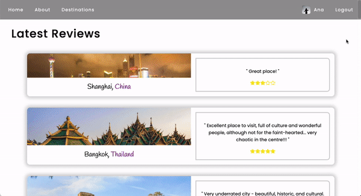
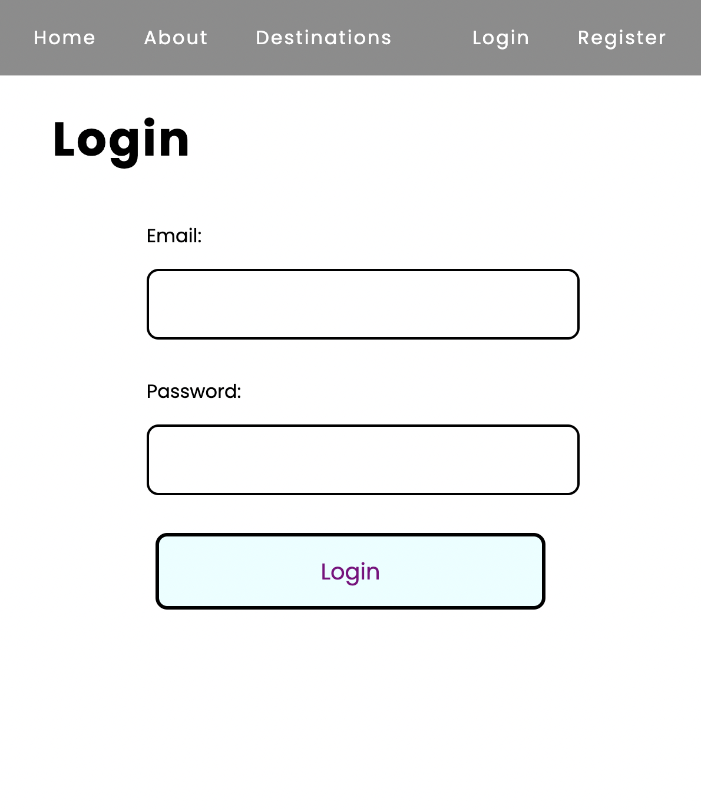
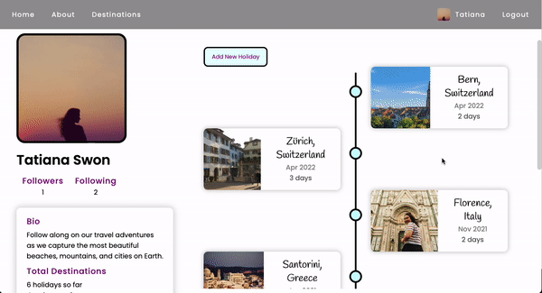
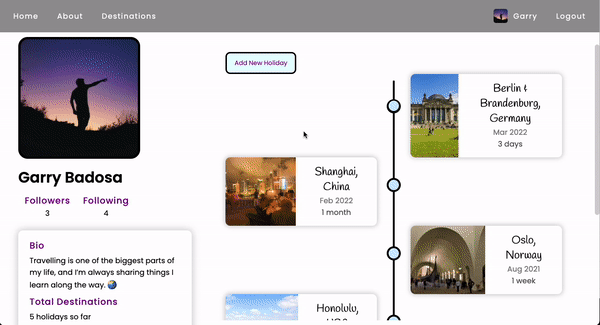
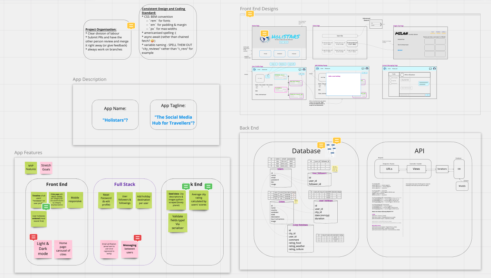
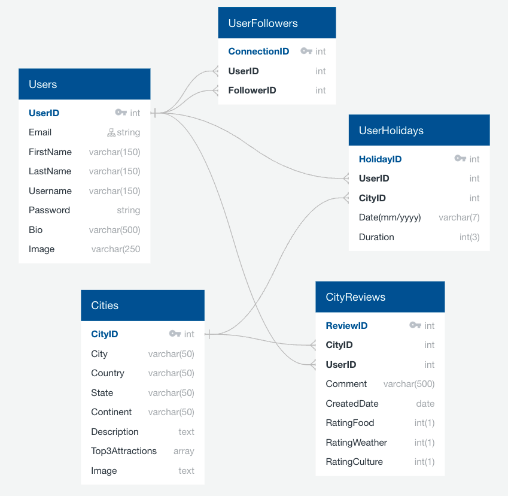
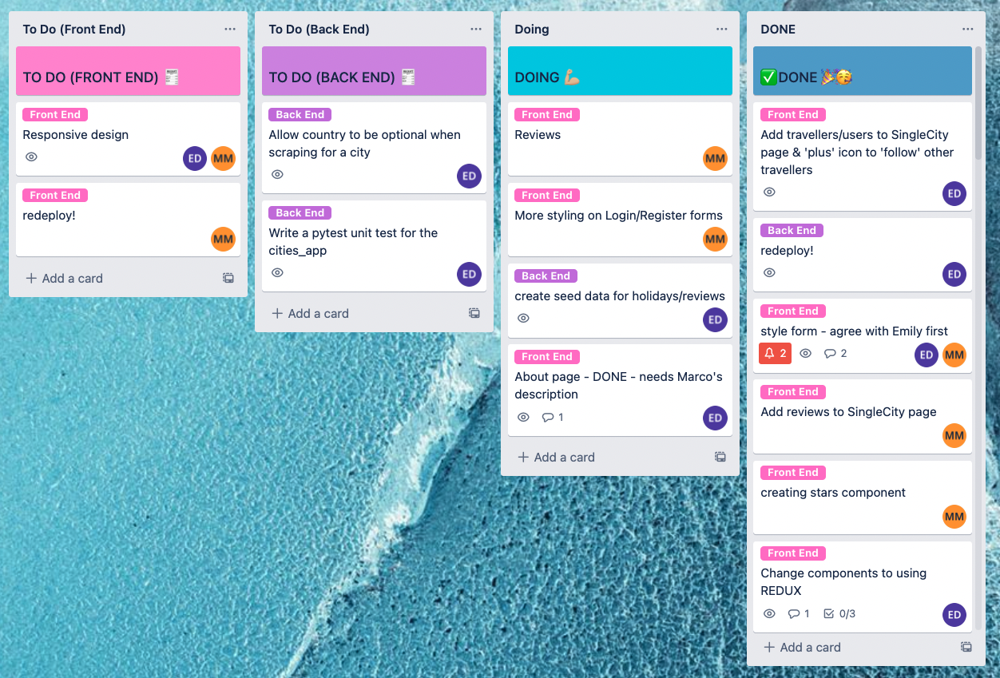

# Holistars

A full stack social media app for travellers that lets users browse destinations, read and leave reviews, follow other travellers, and create a timeline of their own holidays.
This project was created by [Marco Manunta](https://github.com/frozenborder72) and me in the span of around 10 days. For a full list of this app's features, see the [Features](#features) section below.

**This repo contains code for the back end api only; code for the front end client lives [here](https://github.com/emilydaykin/Holistars-Client).**

## Application Walkthrough

### Home Page (Unauthenticated = Welcome Page; Authenticated = News Feed)
<p align="center">
  
  
</p>

### About, Login & Register Pages
<p align="center">
  
  
  
</p>

### Destinations
<p align="center">
  
</p>

### Personal Profile Page
<p align="center">
  
</p>

### Single City
<p align="center">
  
</p>

### Dynamically Scrape Holiday Destination
<p align="center">
  
</p>

## Tech Stack

### Front End
- React
- Redux
- API Handling: Axios
- Pure CSS with Sass
- React-Router-Dom

### Back End
- Server: Django & Django Rest Framework
- Database: PostgreSQL
- Authentication: JSON Web Token (pyJWT)
- Scraping: Python & Beautiful Soup

### Collaboration & Development
- Git, GitHub
- Trello (project management)
- Postman (API testing)
- Miro (wireframing, planning)
- Npm & Pipenv
- Deployment:
  - Front End: Netlify
  - Back End: Heroku

## Features
- Display of all destinations, and routing to an individual city page with descriptions, top attractions, reviews and travellers
- Real time searching through all destinations by city, country, description or top attractions
- Average rating (over food, weather and culture categories) of each destination shown (created by a python property decorator in the Django model)
- Log In, Register and Log Out functionality
- Once logged in, the user can:
  - View a news feed on their home page which orders recently-reviewed/rated destinations
  - Redirect to their profile page via an icon & name that appear immediately in the navbar
  - Add a holiday to their profile timeline
  - Dynamically scrape for a holiday destination if not listed in database, then add it to the database
  - Leave a review for a destination and rate it (by food, weather and culture).
  - Follow other travellers

## Installation
- Run the [deployed application](https://holistars.netlify.app)!
  - Feel free to register and then use your own login credentials, or try a demo one using:
    - Username: `ana@user.com`
    - Password: `Password1!`
- Or run it locally. (From root level of directory):
  - Server: `pipenv shell` &#8594; `pipenv install` &#8594; `python manage.py migrate` &#8594; `python manage.py loaddata data/seed_<table>.json` (for table in 'users', 'cities', 'holidays', 'reviews', 'followers') &#8594; `python manage.py runserver`
  - Client: `npm install` &#8594; `npm start`

## Planning & Wireframing:

### Whiteboarding (Miro):
<p align="center">
  
</p>

### Entity Relationship Diagram (ERD via QuickDBD)
<p align="center">
  
</p>

### Task Management (Trello)
<p align="center">
  
</p>

We agreed on some conventions, like using one to many relationships only for the database, using the BEM methodology for our CSS classes, the 7-1 folder structure for Sass modules, and the async/await syntax for asynchronous functions, and decided to work on both the backend and the frontend by assigning each features to complete front to back. The work was split as such:

#### Author Contributions:
Emily: Implementing the live scraping search, cities section, holidays sections, and the connections (followings) between users

Marco: Implementing Redux, authentication, users sections, reviews section and the stars component

## Architecture:

### Front End:
- React Components to compartmentalise code
- Redux to manage state across the entire application
- React Hooks for component state management and handling side effects
- Pure CSS (SASS) and agreed upon Block-Element-Modifier (BEM) methodology
- Single Page Application (`react-router-dom`) using `Link`, `useNavigate`, `useLocation` and `useParams`

### Back End:
- 5 tables/models in PostgreSQL, only one-to-many relationships
- All security checks (user access credentials) done in Django in the back end:
  - Email validation
  - Password encryption
  - Obscuring the password response in the database and from the client side
  - Login credentials expire after 1 day
- Data seeding of 15 user profiles, 32 pre-scraped cities, 39 holidays, 33 reviews and 9 following-follower relationships.

## Featured Code Snippets

### Front End

#### The Redux Slice for users (Marco)
```
import { createSlice, createAsyncThunk } from '@reduxjs/toolkit';
import axios from 'axios';

const USERS_URL = `${process.env.REACT_APP_API_URL}/authentication`;

const initialState = [];

export const fetchUsers = createAsyncThunk('users/fetchUsers', async () => {
  try {
    const response = await axios.get(
      `${process.env.REACT_APP_API_URL}/authentication`
    );
    return response.data;
  } catch (err) {
    return err.message;
  }
});

export const registerUser = createAsyncThunk(
  'users/registerUser',
  async newUser => {
    try {
      const response = await axios.post(`${USERS_URL}/register/`, newUser);
      return response.data;
    } catch (err) {
      return err.message;
    }
  }
);

const usersSlice = createSlice({
  name: 'users',
  initialState,
  reducers: {},
  extraReducers(builder) {
    builder
      .addCase(fetchUsers.fulfilled, (state, action) => {
        return action.payload;
      })
      .addCase(registerUser.fulfilled, (state, action) => {
        state.users.push(action.payload);
      });
  },
});

export const selectAllUsers = state => state.users;
export const selectUserById = (state, id) =>
  state.users.find(user => user.id === id);

export const { userRegistered } = usersSlice.actions;

export default usersSlice.reducer;

```

#### Another piece of code that I think is worth mentioning is the Stars component, reused multiple times across the app, and that allows half stars (thanks also to font-awesome): (Marco)
```
import React from 'react';

const Stars = ({ value }) => {
  return (
    <div className='stars'>
      {Array(5)
        .fill(true)
        .map((_, index) => (
          <span key={index}>
            <i
              style={{ color: '#f8e825' }}
              className={
                value - index >= 1
                  ? 'fas fa-star'
                  : value - index >= 0.5
                  ? 'fas fa-star-half-alt'
                  : 'far fa-star'
              }
            ></i>
          </span>
        ))}
    </div>
  );
};

export default Stars;

```

#### Combining Redux-Toolkit and React useState & useEffect hooks to manage the display of all versus searched cities (Emily)
```
const allCitiesRedux = useSelector(selectAllCities);
const [cities, setCities] = useState(null);

const getCityAvgRating = (city) =>
  city.reviews.reduce((total, review) => total + review.avg_rating, 0) / city.reviews.length;

useEffect(() => {
  const getCityData = async () => {
    const allCities = await getAllCities();
    const shuffledCities = allCities.sort(() => 0.5 - Math.random());
    setCities(shuffledCities);
  };
  getCityData();
}, []);

const filterThroughCities = async (searchInput) => {
  if (searchInput) {
    const filteredCities = await searchCities(searchInput);
    setCities(filteredCities);
  } else {
    setCities(allCitiesRedux);
  }
};

const handleSearchChange = (e) => {
  filterThroughCities(e.target.value);
};
```

### Back End

#### The follower-following relationship between users is an intermediary table of 'User Followers' in the database structure (Emily)
```
from django.db import models
from django.contrib.auth import get_user_model

User = get_user_model()

class Follower(models.Model):
    """ Followers table:
          - user = the person being followed (target)
          - follower = the user following the user
    """
    user = models.ForeignKey(User, related_name='followers',
                             on_delete=models.SET_NULL, null=True)
    follower = models.ForeignKey(User, related_name='followings',
                                 on_delete=models.SET_NULL, null=True)

    def __str__(self):
        return f'{self.follower} is following {self.user}'
```

#### Dynamically scraping Lonely Planet's search results based on users' search input ('city' & 'country') in the app (Emily)
```
import requests
from unidecode import unidecode
from bs4 import BeautifulSoup


def search_lonely_planet(city_name, country_name):
    """ This function takes the POST request `{{baseURL}}/scrape/search/` data
        when a new destination is searched, and returns a valid Lonely Planet URL.
    """

    city_name = unidecode(city_name.lower())
    country_name = unidecode(country_name.lower())

    if requests.get(f'https://www.lonelyplanet.com/{country_name}/{city_name}').status_code == 200:
        city_url_to_scrape = f'https://www.lonelyplanet.com/{country_name}/{city_name}'
        return [city_url_to_scrape]

    # If city URL on lonely-planet isn't as straighforward, SEARCH the site:

    # Bypassing Response [403] with headers:
    header = {
        "user-agent": "Mozilla/5.0 (Windows NT 10.0; Win64; x64) AppleWebKit/537.36 (KHTML, like Gecko) Chrome/74.0.3729.169 Safari/537.36",
        'referer': 'https://www.google.com/'
    }

    page = requests.get(
        f'https://www.lonelyplanet.com/search?q={city_name}', headers=header)
    soup = BeautifulSoup(page.content, 'html.parser')

    search_results = soup.find_all(
        'a', class_='jsx-1866906973 ListItemTitleLink')
    if len(search_results) == 0:
        return ''
    else:
        cities_urls_to_scrape = []
        for result in search_results:
            if (unidecode(result['href'].split('/')[0]) == country_name):
                cities_urls_to_scrape.append(
                    f"https://www.lonelyplanet.com/{result['href']}")

        return cities_urls_to_scrape
```

Since we had to calculate the average of the reviews' ratings for every city, and in turn every review rating is the average of three ratings (food, weather and culture), the **`@property` decorator in the Review model** was used that allows access to computed values as properties, so that in the frontend we wouldn’t have to use a nested loop in the reducer function that calculates the average rating of the reviews for a city (Marco)
```
@property
def avg_rating(self):
    return (self.rating_food + self.rating_weather + self.rating_food) / 3

def __str__(self):
    return f'{self.city} by {self.user} average rating: {self.avg_rating}'
```

## Wins, Challenges & Bugs

### Wins & Challenges
There were a number of challenges in this project that turned into rewarding wins after hours/days of solving them. Being able to implement in a working app what we set out to do at the beginning was definitely a win, namely Redux for Marco and live search scraping for me.
For me personally, these included:
- Web scraping Lonely Planet to seed the database, and writing a script that would dynamically scrape Lonely Planet's search results, bug-free, whenever a user searched for a city-country combination. Bypassing 403 responses with headers, and writing robust code to cover varying page responses were great learning experiences and very satisfying.
- The follower-following model, since it was hard to visiualise initially how to link users to other users within the same table. 
- Getting react state and redux to work together seamlessly in some components (the destinations display and search filter for example) was a challenge, particularly the judgement calls of which situations required react states on top of redux.

### Bugs
Not quite a bug as it follows logically from how the React rendering mechanism works, but since we hadn't the time to implement Redux for the holidays feature, when you add a holiday for a user you have to refresh the user profile page in order for it to appear.

## Future Features + Key Learnings

### Future Features
Although implemented in the back end server, the front end client doesn't make use of a couple of API functionalities such as updating (same user) & deleting (admin only) a user profile, and updating or deleting a user's own holiday. Further improvements include updating a deleting city reviews, toast notifications when a user has a new follower, form validation, and messaging functionality between users.

### Key Learnings
**Marco**: "Besides all the technical features and libraries (live scraping, Redux) that we learnt on the go, working with a like minded and extremely talented developer like Emily was a real pleasure, that made working in a team a fantastic and challenging developing and learning experience."

**Emily**: "Planning and creating this application as a team was incredibly fun. On top of the technical learnings mentioned, it was great experience to collaborate with and learn from a brilliant developer like Marco in this project. What we achieved together and how we helped unblock each other (thank you Marco!) definitely showed how the whole can be greater than the sum of its parts."